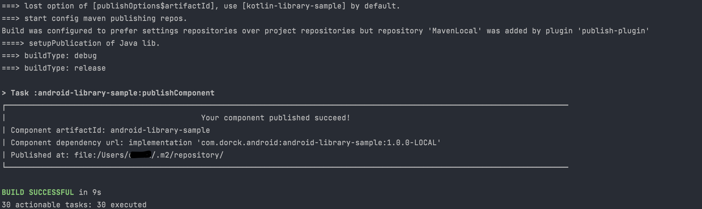

## Component Publisher

[](https://search.maven.org/artifact/cn.dorck.android/component-publisher)  [](https://plugins.gradle.org/plugin/cn.dorck.component.publisher)  [](https://opensource.org/licenses/Apache-2.0)

 A Gradle plugin to easily publish components based on maven-publish. 

> *Latest release version: **1.0.0***
>
> *You can find the latest released plugin on [Gradle Plugin Portal](https://plugins.gradle.org/plugin/cn.dorck.component.publisher).*

## Todo & Progress

- [x] Publish this plugin onto gradle plugin portal.
- [x] Improvement of usage doc.
- [ ] Run the publication task with options by project properties.
- [ ] Support signing artifacts before publishing.
- [x] Import GitHub Actions for automatically publishing.
- [ ] Use TestKit to test functions of Gradle plugin.

## Features

- Publish components easily without any complex configs.
- Support multi type components. e.g, Java library, Android library, Kotlin lib, Gradle lib etc.
- Support publishing libraries into local repos, [Sonatype](https://central.sonatype.org) release/snapshot repos or [Github packages](https://docs.github.com/en/packages).
- Safely configure your sensitive credentials in `local.properties`.

## Getting Started

You can quickly publish your own components by following steps with this plugin.
#### 1. Apply plugin

You need apply `cn.dorck.component.publisher` in `build.gradle`:

```kotlin
plugins {
  id("cn.dorck.component.publisher") version "1.0.2"
}
```

#### 2. Configure publish options

You can customize your own publication options like this in your module `build.gradle` to be released:

```kotlin
publishOptions {
    group = "com.dorck.android"
    version = "0.1.0-LOCAL"
    artifactId = "sample-library"
}
```

As shown above, you will publish `sample-library` component into `mavenLocal()` which stores at `/Users/<username>/.m2/repository`.

Currently, it supports the following more configuration properties:

| Option               | Description                                                  |
| :------------------- | :----------------------------------------------------------- |
| group                | The group of maven publication. If empty, use project's group. |
| artifactId           | The artifactId of maven publication. If empty, use project's name. |
| version              | The version of maven publication. If empty, use project's version. |
| userName             | The username of credentials for maven repo.                  |
| password             | The password of credentials for maven repo.                  |
| releaseRepoUrl       | Url for maven release repository.                            |
| snapshotRepoUrl      | Url for maven snapshot repository.                           |
| description          | Library description written in pom file.                     |
| packSourceCode       | Whether to package the source code into jar/aar.             |
| transitiveDependency | Will transitive dependencies be required.                    |

> If you want to publish component onto remote repositories, you need to specify the `userName` , `password` and `releaseRepoUrl` or `snapshotRepoUrl`.

#### 3. Execute publication task

Now, you can easily publish your component by gradle command:

```
$ ./gradlew :<component module name>:publishComponent
```

Next you will see the following log output from the terminal:



#### 4. Configure stable options

Normally, our repository urls and credentials information are the same for different components. To prevent repeated configuration, a global default options properties file is supported here. You can just put your global properties in root project `local.properties` like this:

```properties
REPO_USER=Moosphan
REPO_PASSWORD=*****
REPO_RELEASE_URL=https://maven.xx.xx/repository/releases/
REPO_SNAPSHOT_URL=https://maven.xx.xx/repository/snapshots/
```

> **Note**: If you want to specify repo options for a component, just add repo info in its `build.gradle` >> `publishOptions` DSL.

### Article Reference

- [*Gradle 发布插件的前世今生*](https://dorck.cn/gradle/2022/08/20/component-publication-plugin/)
